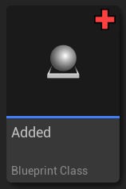
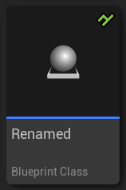
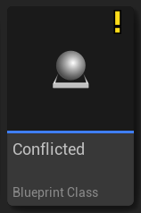
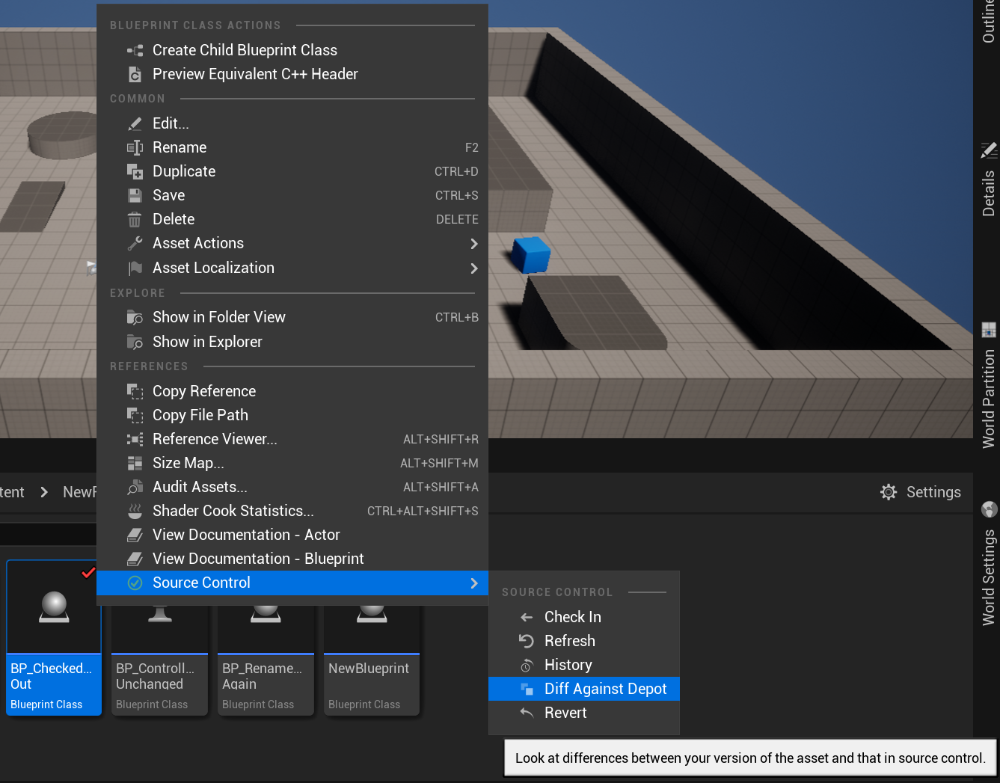
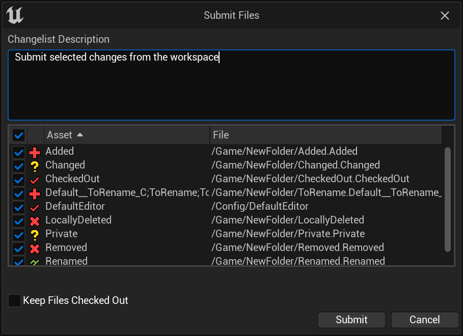
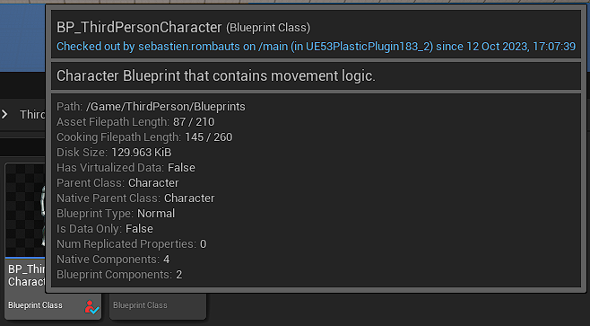
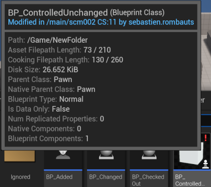
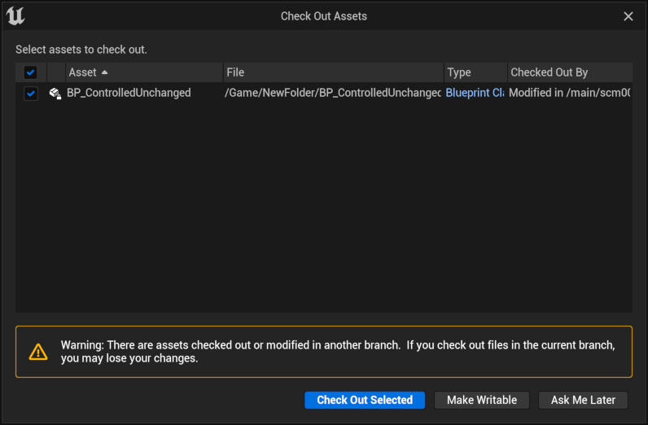
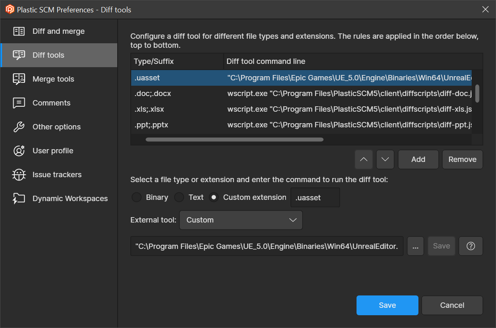

Plastic SCM plugin for Unreal Engine
------------------------------------

[](https://github.com/PlasticSCM/UEPlasticPlugin/releases)
[](https://gitter.im/UE4PlasticPlugin)

This is the **official [Plastic SCM](https://www.plasticscm.com/) Source Control Provider plugin for Unreal Engine 4 & 5** (UE 4.11 to 4.27, and UE 5.0 to 5.1).
An old version 1.4.6+ has been integrated in Unreal Engine 4.24 and has been shipping with it since then.
The most recent version 1.6.2 has been integrated in Github for the upcoming Unreal Engine 5.1 so it is eventually going to ship to everyone.
But in the meantime, if you have a project of a certain size, chances are you need to upgrade manually to a version we provide from Github
in order to benefit from all the performance improvements we have made since then.
See the Status section below for more details.

It is not intended to replace [Plastic SCM GUI](https://www.plasticscm.com/documentation/gui/plastic-scm-version-control-gui-guide)
or [command line interface "cm"](https://www.plasticscm.com/documentation/cli/plastic-scm-version-control-cli-guide).
It is a complementary tool improving efficiency in your daily workflow with assets in Editor.

It automates tracking of assets, brings common SCM tasks inside the Editor, and provides visual diffing of Blueprints.
It also helps import an existing Unreal Project into source control, with appropriate *ignore.conf* file.
Since Unreal does not manage C++ source code, but only assets, the plugin is especially useful for GDs and artists.

## Table of Contents
 - [User Guide](#user-guide)
   - [Plugin Setup](#plugin-setup)
   - [Project Setup](#project-setup)
     - [Enable Source Control](#enable-source-control)
     - [Create a new workspace](#create-a-new-workspace--repository-directly-from-unreal)
     - [Source Control settings](#source-control-settings)
     - [Project Settings](#project-settings)
     - [Editor Preferences](#editor-preferences)
   - [Working in Editor](#working-in-editor)
     - [Unreal Documentation](#unreal-documentation)
     - [Status Icons](#status-icons)
     - [Source Control Menu](#source-control-menu)
     - [Source Control Windows](#source-control-windows)
     - [Redirectors](#redirectors)
     - [Detect Changes on other Branches](#detect-changes-on-other-branches)
     - [Merge conflicts on Blueprints](#merge-conflicts-on-blueprints)
     - [Workflows](#workflows)
       - [Mainline](#mainline)
       - [Task branches](#task-branches)
   - [Plastic SCM Setup](#plastic-scm-setup)
     - [Configure Locks for Unreal Assets (exclusive checkout)](#configure-locks-for-unreal-assets-exclusive-checkout)
     - [Configure Visual Diff of Blueprints from Plastic SCM GUI](#configure-visual-diff-of-blueprints-from-plastic-scm-gui)
 - [Status](#status)
 - [Support](#support)
   - [Enable debug logs](#enable-debug-logs)
   - [Report an issue](#report-an-issue)
 - [Source code architecture](#source-code-architecture)
 - [Copyright](#copyright)

## User Guide

### Plugin Setup

#### Unreal default version of the plugin

An old version of this PlasticSCM plugin 1.4.6 has been integrated in Unreal Engine and has been shipping with it since UE4.24 and UE5.0.
A very recently updated version 1.6.2 shipped with UE5.1.

**Why?**: Why is it integrated, as opposed to, eg. being shared through the Marketplace?

It helps with discoverability of the plugin, and it is the easiest way to get started with Plastic SCM in Unreal Engine.
But it will always be lagging somewhat behind the latest release in Github.

#### Manual installation from the latest version here

**Why?**: Why would you update to latest version in Github?

If you want the latest features, performance improvements and bug fixes that are missing from Unreal integrated plugin.

 1. Download the [latest binary release UE5PlasticPlugin-x.x.x.zip](https://github.com/PlasticSCM/UEPlasticPlugin/releases) targeting your UE5 version (resp UE4).
 2. Either:
     1. Unzip the content of the ZIP directly at the root of your project folder.
        This creates a "Plugins\UEPlasticPlugin\" subdirectory into your project.
        This is the way to go to use Plastic SCM on a specific project,
		and to share the plugin with other team members by adding it to source control.
        Some users reported they also had to remove the integrated plugin from "Engine\Plugins\Developer\PlasticSourceControl" to avoid a collision.
        This is only needed for some specific use case I have not yet identified (eg. on CI/CD, or on Unix OSes).
     2. Unzip the content of the ZIP in the Engine\ directory of UE4.x directly for all your projects
        (for instance "C:\Program Files\Epic Games\5.1\Engine\")
        This creates a "UEPlasticPlugin" folder into the "Plugins\" subdirectory.
        Then remove the integrated plugin from "Engine\Plugins\Developer\PlasticSourceControl" to avoid the collision.
        This is the way to enable Plastic SCM for all Unreal Engine projects on the machine.
 3. Then, launch your Unreal project, click on the Source Control icon "Connect to Source", select "Plastic SCM".

#### How to build from sources

**Why?**: If your project is already a C++ project, you only have to re-generate Visual Studio project files (step 4 below) and the plugin will get rebuilt the next time you compile your project.

Else, if you want to rebuild the plugin for a Blueprint project:

 0. You need Visual Studio 2015 or 2017 with C++ language support (free Community Edition is fine).
 1. Launch the Unreal Engine Editor, create a new C++ **Basic Code** Project (No Starter Content), for instance UnrealPlasticSCM. This should launch Visual Studio, build the game project, and open it into the Editor.
 2. Close the Editor, then using the file explorer, create a new **Plugins** directory at the root of your project.
 3. Clone the source code of the plugin into this _Plugins_ directory (for instance _Plugins\UEPlasticPlugin_).
 4. Right-click on your project's **.uproject** file, **Generate Visual Studio project files**.
 5. In Visual Studio, **Reload All** and **Build Solution** in **Development Editor** mode. That's it, the plugin is built (resulting dlls are located in _Plugins\UEPlasticPlugin\Binaries\Win64_).

To release the plugin, zip the _Plugins_ folder. But before that, remove the _Intermediate_, _Screenshots_ and _.git_ folders, and also the big *.pdb files in _Plugins\UEPlasticPlugin\Binaries\Win64_.

### Project Setup

Start by [saving your connection credentials with the Plastic SCM GUI](#save-connection-credentials)

#### Enable Source Control

Launch you Unreal project, look at the Source Control menu at the bottom-right


Launch you Unreal project, click on the Source Control icon "Connect to Source"


Then select "Plastic SCM" plugin


#### Create a new workspace & repository directly from Unreal

Source Control Login window, to create a new workspace/a new repository, click on "Initialize workspace" (example of a cloud repository):


Or on a server running on premise, using ip:port:


This creates an appropriate ignore.conf file, add all relevant files to source control (.uproject, Config & Content subdirectories)
and can also do the initial commit automatically at the end.

Wait for this to succeed before accepting source control settings to not lock the UI & mess with the initialization!


#### Source Control settings


Source control settings can be changed using the Source Control menu,
and are saved locally in `Saved\Config\WindowsEditor\SourceControlSettings.ini`.

- BinaryPath: Path to the Plastic SCM Command Line tool 'cm' binary. Default is good if the cli is in the PATH. Can be changed to an absolute path to the cm executable if needed.
- UpdateStatusAtStartup: Triggers an asynchronous "Update Status" operation at Editor startup. Can take quite some time on big projects, with no source control status available in the meantime.
- UpdateStatusOtherBranches: Enable Update status to detect more recent changes on other branches in order to display the "Changed In Other Branch" warnings and icon. 
- EnableVerboseLogs: Override LogSourceControl default verbosity level to Verbose (except if already set to VeryVerbose).

##### Sharing settings

In order to share this with the team, copy and rename this file into `Config\DefaultSourceControlSettings.ini`,
add it to source control and submit it.

The minimal useful setting would be selecting the proper provider,
but it can be useful to set a few settings if different than the defaults:

```ini
[SourceControl.SourceControlSettings]
Provider=Plastic SCM

[PlasticSourceControl.PlasticSourceControlSettings]
BinaryPath=cm
UpdateStatusAtStartup=False
UpdateStatusOtherBranches=True
EnableVerboseLogs=False
```

#### Project Settings

##### Source Control

Unreal Engine allows you to configure project-related settings.

TODO: Some are not yet supported by the plugin:
- **Should Delete New Files on Revert**
- **Enable Uncontrolled Changelists**


##### Source Control - Plastic SCM

The plugin allows you to configure project-related settings.


There are 3 settings available at the moment:

 - **User Name to Display Name**
   - For each entry in this dictionary, the Editor will replace the user name in the key with the display value you specify.
 - **Hide Email Domain in Username** (true by default)
   - This setting toggles the visibility of domain names in user names, if the user name is an email.
 - **Prompt for Checkout on Change** (true by default)
   - Un-checking this setting will make the Editor consider all files as already checked out. In that case, you won't get
     any notifications when you modify assets, and the "Checkout Assets" dialog won't show when you save those changes.
     This mimics how Git works, i.e. allowing the user to perform changes without worrying about checking out items.
     Note: Changelists don't currently support locally changed assets (ie not checked-out)
 - **Limit Number Of Revisions in History** (50 by default)
   - If a non-null value is set, limit the maximum number of revisions requested to Plastic SCM to display in the "History" window.
   - Requires [Plastic SCM 11.0.16.7608](https://www.plasticscm.com/download/releasenotes/11.0.16.7608) that added support for history --limit

#### Editor Preferences

##### Source Control

Unreal Engine allows you to configure Editor behaviors. In particular:

 - **Tools for diffing text**
   - Configure the external diff tool needed to compare revisions of assets that are not Blueprints (eg Materials)
 - **Prompt for Checkout on Asset Modification**
   - Trigger a notification "N files need Checkout" with a link to checkout the asset(s) as soon as a change is made to an asset (without even saving it).
 - **Automatically Checkout on Asset Modification**
   - Checkout an asset as soon as a change is made to it (without even saving it). Will not show the "checkout" notification.
 - **Add New Files when Modified**
   - Automatically add "private" assets to source control when saving them.
 - **Use Global Settings**
   - Share the Source Control Settings ini files between all projects.


### Working in Editor

#### Unreal Documentation

Official documentation from Epic Games:
 - [Source Control Inside Unreal Editor](https://docs.unrealengine.com/5.0/en-US/using-source-control-in-the-unreal-editor/)
 - [Diffing Unreal Assets (blog post)](https://www.unrealengine.com/blog/diffing-unreal-assets)

Plastic SCM forums:
 - [Unreal Engine section in Plastic SCM forums](https://forum.plasticscm.com/forum/42-unreal-engine/)

#### Status Icons





 1. **New**, unsaved asset (not yet present on disk).
 2. **Private**, the asset is not in source control.
 3. **Added** to source control.
 4. Source **Controlled** but not checked-out nor locally changed




 5. Locally **Changed** without checkout, or **Private** ie not source controlled 
 6. **Checked-out** exclusively to prevent others from making modifications (if Locks are enabled on the server)
 7. **Redirector** added by a Move
 8. **Moved** or Renamed




 9. **Locked somewhere else**, by someone else or in another workspace (if Locks are enabled on the server)
 10. **Not at head revision**, the asset has been submitted with a newer revision on the same branch
 11. **Changed in another branch**, the asset has been changed in a newer changeset in another branch
 12. **Merge conflict**, the asset has been changed in two separate branches and is pending merge resolution

#### Source Control Menu

##### Unreal Engine 4 Source Control Menu

Source Control status tooltip, when hovering the Source Control icon in toolbar:


Source Control top Menu, extended with commands specific to Plastic SCM:


##### Unreal Engine 5 Source Control Menu

Source Control Menu and status tooltip, extended with commands specific to Plastic SCM:


Each Asset Editor also provide some source control operation, typically to Submit Content:


The Blueprint Editor also provide a toolbar drop-down to visual diff against a previous revision:


#### Source Control Windows

Using the Content Browser context source control sub-menu, you can call in specific actions and windows:


##### Submit Files

Submit Files to Source Control window, to check-in selected assets directly (see also Changelists below):


##### View Changelists

Changelists are the new way to group checked-out files by topic in Unreal Engine 5.0, to submit them in coherent batches.
UE5.0 includes Validation checks to ensure there are no missing dependencies outside a changelist, and that all assets are saved on disk before submitting.


##### File History

File History window, to see the change-log of an asset:


##### Blueprint Diff

Visual Diffing of different revision of a Blueprint:


##### Material Diff

Textual Diffing of a Material:


#### Redirectors

When Source Control is enabled Unreal creates a redirector whenever an asset is renamed or moved,
so that other developers relying on its old name / location can still work with other assets referencing it.

This means, you end up with two files that you have to submit, even if by default they don't show up in the Content Browser.

You can show them in the Content Browser using a dedicated filter:


You can also delete them recursively using the context menu "Fix Up Redirectors in Folder":


#### Detect Changes on other Branches

If you are making use of multiple branches, either for releases and patches, or for tasks or features,
you can enable an option to check for changes in all other branches.

Enable "Update Status" to also checks the history to detect changes on other branches:


Tooltip in the Content Browser when an asset is already checked-out somewhere else:


Tooltip in the Content Browser when an asset has been modified in another branch:


Warning when trying to checkout an asset that has been modified in another branch:

 
Warning when trying to modify an asset that has been modified in another branch:


#### Merge conflicts on Blueprints

In case you ever use branches with binary assets without relying on exclusive checkouts (file locks) ([see Workflows below](#workflows))
you will encounter cases of merge conflicts on binary assets.
You have to trigger the resolve in the Plastic SCM GUI, but then skip it without saving changes in order to let the Editor present you with a visual diff.

TODO: take screenshots of Plastic SCM GUI

Branch explorer showing the merge pending with an asset in conflict:


Corresponding icon in the Content Browser (only showing after the resolved has been triggered in Plastic SCM):


Right click on the asset in conflict to open the _Merge_ Tool (just a conflict solver with 3-way Visual Diff, no merge):


Visual diff of Blueprint properties in conflict:


Visual diff of a Blueprint Event Graph in conflict:


#### Workflows

##### Mainline

The most common workflow with Unreal Engine binary assets is the one taught by Perforce:
It relies mostly on one main branch (stream) for everyone with [exclusive checkouts (locks) for the whole Content/ subdirectory](#configure-locks-for-unreal-assets-exclusive-checkout),
in order to prevent merge conflicts on a uasset or a umap file.

This typical workflow would work the best with **the workspace in partial mode** configured using Gluon GUI.
The reason is that a partial workspace enables you to checkin assets without the need to update the workspace before.

1. update the workspace (get latest) using Gluon GUI, with the Unreal Editor closed (since the Editor is locking assets, but also .exe & .dll files that might be in source control)
2. start the Editor, make modifications and checkout assets
3. then check-in (submit) the assets, either from within the Editor, or from the GUI after closing the Editor (the benefit of closing is you ensure that everything is saved)
4. when needed, close the Editor and update the workspace again

If you try to use a full workspace (with Plastic SCM GUI instead of Gluon) you will often need to update the workspace before being able to checkin.

##### Task branches

Handling of binary assets works best in only one branch (regardless of the source control used)
since they cannot be merged, and since they increase the cost (time/bandwidth) of switching between branches.

But with Plastic SCM you can use branches that are easy and cheap to create and merge:
using them for code will enable you to leverage the built-in code review on these branches.

Note that some studios also use task branches for assets, and include them in their code reviews.
Plastic SCM locks extend to all branches, preventing two people from working at the same time on the same assets regardless of the branch they are one.
The Plastic plugin also offers [some branch support to warn users if an asset has been changed in another branch](#branches-support).

To use branches, you would need to also close the Editor before switching from a branch to another, and before merging a branch into another:

1. create a child branch from main using Plastic GUI
2. switch to it, updating the workspace, with the Unreal Editor closed
3. start the Editor, make modifications and checkout assets
4. then check-in the assets (remember to save everything, or close the Editor to make sure of it)
5. close the Editor
6. create a code review from the branch
7. create a new task branch from main or go back to main to merge branches

The plugin also leverages the [visual diff merge conflicts resolution tool from the Editor](#merge-conflicts-on-blueprints) but this is a pain and isn't working as expected currently (as of 1.5.0 & UE5.0)

### Plastic SCM Setup

#### Save connection credentials

The plugin works with the command line interface "cm" that currently requires your credentials to be stored.
Use the Plastic SCM or Gluon GUI to enter and save your credentials before enabling Plastic SCM in Unreal.

#### Configure Locks for Unreal Assets (exclusive checkout)

[Administrator guide - Chapter 7: Configuring exclusive checkout (Lock)](https://www.plasticscm.com/documentation/administration/plastic-scm-version-control-administrator-guide#Chapter7:Configuringexclusivecheckout(Lock))

Binary assets should be locked for exclusive access to avoid merge conflicts.

To lock all assets on the whole `Content` directory, you need to put a `lock.conf` in your server directory (for instance `C:\Program Files\PlasticSCM5\server`) with this content:

    rep:<repname> [lockserver:[<server>:<port>]]
    /Content

For instance the more generic one would be:

    rep:*
    /Content

or to be more specific to one repository:

    rep:UE5PlasticPluginDev lockserver:localhost:8087
    *.uasset
    *.umap

On Plastic Cloud, you can just set-up lock rules like that:

    /Content

#### Configure Visual Diff of Blueprints from Plastic SCM GUI

In "Preferences -> Diff tools" add a new config for uasset and move it up **before** the existing `$binary` one:


The command line needs the quoted path to the UnrealEditor.exe, the quoted patch to your ".uproject" file, -diff, then the source & destination files variables also quoted

    "C:\Program Files\Epic Games\UE_5.0\Engine\Binaries\Win64\UnrealEditor.exe" "C:\wkspaces\ProjectName\ProjectName.uproject" -diff "@sourcefile" "@destinationfile"

or for Unreal Engine 4:

    "C:\Program Files\Epic Games\UE_4.27\Engine\Binaries\Win64\UE4Editor.exe" "C:\wkspaces\ProjectName\ProjectName.uproject" -diff "@sourcefile" "@destinationfile"

#### Text Diff of any assets

To configure a text diff for any uasset (not only Blueprints) use this command instead

    "C:\Program Files\Epic Games\UE_5.0\Engine\Binaries\Win64\UnrealEditor-Cmd.exe" "C:\wkspaces\ProjectName\ProjectName.uproject" -NoShaderCompile -run="DiffAssets" %1 %2 DiffCmd="C:\Program Files\PlasticSCM5\client\mergetool.exe {1} {2}"

## Status

This version here is the development version, so it always contains additional fixes, performance improvements or new features compared to the one integrated in Engine.

### Version 1.7.0 2022/12/09 for UE 5.1.1/Github 5.2.x and UE 4.27.2:
 - manage connection to the server
 - show current branch name and CL in status text
 - display status icons to show controlled/checked-out/added/deleted/private/changed/ignored/not-up-to-date files
 - display locked files, and by who
 - Detect Changes on other Branches, to check outdated files vs. remote across multiple branches
 - add, duplicate a file
 - move/rename a file or a folder
 - revert modifications of a file (works best with the "Content Hot-Reload" option since UE4.15)
 - check-in a set of files with a multi-line UTF-8 comment
 - migrate (copy) an asset between two projects if both are using Plastic SCM
 - delete file (but no way to check-in them, see known issues below)
 - update workspace to latest head (Sync command)
 - show history of a file
 - visual diff of a blueprint against depot or between previous versions of a file
 - Changelists in Unreal Engine 5: create, edit, move files, delete (no shelves yet)
 - One Files Per Actor (OFPA) in Unreal Engine 5: status batching to execute only one operation for all files in all subfolders
 - initialize a new workspace to manage your UE4 Game Project.
 - make the initial commit with a custom message
 - create an appropriate ignore.conf file as part of initialization
 - also permit late creation of the ignore.conf file
 - show conflicted files and 3-way visual diff
 - solve a merge conflict on a blueprint
 - top-menu global "Sync" instead of on folder's context menu
 - top-menu global "undo unchanged" and "undo all checkout"
 - [Partial Workspace (Gluon, for artists)](https://www.plasticscm.com/gluon) [see also](http://blog.plasticscm.com/2015/03/plastic-gluon-is-out-version-control.html)
 - Plastic Cloud is fully supported
 - xlinks sub-repositories (for Plugins for instance)
 - Toggle verbose logs from the Source Control settings UI
 - Run 'cm' CLI commands directly from the Unreal Editor Console, Blueprints of C++ code.
 - Use custom icons on UE5.1 for files locally Changed (not checked-out), locally Deleted, Conflicted and Ignored
 - Supported on Windows and Linux

### Feature Requests
 - Unreal Engine 5.1 full support
   - Shelves of Changelists
   - Uncontrolled Changelists
 - Mac OS X Support
 - add a menu entry to switch the workspace to Partial
 - add a setting to configure Plastic SCM to use "read-only flags" like Perforce
   - add a context menu entry to make it locally writable
 - add a menu entry to unlock a file
 - add a setting to pass the --update option to "check-in"
 - add a "clean directory" or "check-in deleted files"

### Known issues
 - Sync & RevertAll crash the Editor in Unreal Engine 5.0 and are temporarily disabled (https://github.com/SRombauts/UEPlasticPlugin/issues/89)
 - Merge Conflict: "Accept Target" crash the UE4.11 Editor (same with Git Plugin)
 - Merge conflict from cherry-pick or from range-merge cannot be solved by the plugin: use the Plastic SCM GUI
 - Editing an asset that is "Changed" but not checked-out pop up a "Files need check-out!" (UnrealEdSrv.cpp) that does nothing when clicked!
 - Bug: the Editor does not handle visual diff for renamed/moved assets

### Features not supported, reserved for internal use by Epic Games with Perforce only
 - Branch and Merge workflow: not handled by the Unreal Editor
 - Directory source control status: not handled by the Unreal Editor
 - tags: get labels (used for crash when the full Engine is under Perforce)
 - annotate: blame (used for crash when the full Engine is under Perforce)

## Support

You can always ask for support in:
 - [Plastic SCM support](https://www.plasticscm.com/support)
 - [Plastic SCM Unreal Engine forum](https://forum.plasticscm.com/forum/42-unreal-engine/)
 - [Unreal Engine forums](https://forums.unrealengine.com/)
 - [Unreal Slackers Discord community](https://discord.gg/unreal-slackers)

### Enable debug logs

#### Enable Verbose logs in Unreal Engine

To help diagnose any issue related to the plugin or to the Editor, toggle Verbose logs in [Source Control settings](#source-control-settings).

Unreal log files are in `<ProjectName>/Save/Logs/ProjectName.log`.

#### Enable logging for Plastic SCM

To help diagnose any issue related to the underlying Plastic SCM "cm" Command Line Interface,
[enable logging for Plastic SCM](https://www.plasticscm.com/documentation/technical-articles/kb-enabling-logging-for-plastic-scm-part-i).

cm log files are typically in `<LOCALAPPDATA>\plastic4\logs\cm.log.txt`.

### Report an issue

To report an issue, please create a support ticket as it helps sort the priorities [Plastic SCM support](https://www.plasticscm.com/support).

You can also use the [Github issue-tracker](https://github.com/SRombauts/UEPlasticPlugin/issues?q=is%3Aissue).

 1. Have a look at existing issues (Open and Closed ones)
 2. Specify your Engine & Plugin versions, and if either are built from sources
 3. Describe precisely your issue
 4. Add reproduction steps, if possible on a basic template project
 5. Post log files whenever possible (see [enable debug logs](#enable-debug-logs) to get the most of it)
    1. Unreal Log file **`<ProjectName>/Saved/Logs/ProjectName.log`** 
    2. cm debug log file typically from **`<LOCALAPPDATA>\plastic4\logs\cm.log.txt`**

### Use merge requests

If you want to help, [Github Pull Requests](https://github.com/PlasticSCM/UEPlasticPlugin/pulls) are welcome!

## Source code architecture

See also [Unreal Engine C++ Coding Standard](https://docs.unrealengine.com/4.27/en-US/ProductionPipelines/DevelopmentSetup/CodingStandard/)

All the relevant C++ source code of the plugin reside in one subdirectory `<ProjectName>/Plugins/UEPlasticPlugin/Source/PlasticSourceControl/Private/`

### Implementations of all the Source Control APIs as C++ interfaces

 - **PlasticSourceControlProvider**.cpp/.h
   - `class FPlasticSourceControlProvider : public ISourceControlProvider`
   - implements the high level source control interface with the mechanism around managing workspace states
 - **PlasticSourceControlOperations**.cpp/.h
   - `classes FPlastic<Operation> : public ISourceControlOperation`
   - implements each source control operation with a dedicated Worker class: add, delete, move, checkout, checkin, revert etc, see eg:
   - `bool FPlasticCheckOutWorker::Execute(FPlasticSourceControlCommand& InCommand)` using the following two classes:
     - **IPlasticSourceControlWorker**.h
       - `class IPlasticSourceControlWorker`
       - interface of one Worker to be implemented for each of the operations
     - **PlasticSourceControlCommand**.cpp/.h
       - `class FPlasticSourceControlCommand : public IQueuedWork`
       - describes the parameters of the work to be executed for one operation
 - **PlasticSourceControlState**.cpp/.h
   - `class FPlasticSourceControlState : public ISourceControlState`
   - implements information about the state of a file
 - **PlasticSourceControlRevision**.cpp/.h
   - `class FPlasticSourceControlRevision : public ISourceControlRevision`
   - implements information about a revision in the history of a file
 - **PlasticSourceControlChangelist**.cpp/.h
   - `class FPlasticSourceControlChangelist : public ISourceControlChangelist`
   - Unique Identifier of a changelist under source control: a "name" in Plastic SCM
 - **PlasticSourceControlChangelistState**.cpp/.h
   - `class FPlasticSourceControlChangelistState : public ISourceControlChangelistState`
   - The state of a pending changelist under source control: description and list of files

### Other most relevant structural files

 - **PlasticSourceControlModule**.cpp/.h
   - `class FPlasticSourceControlModule : public IModuleInterface`
   - Singleton-like entry point of the plugin
 - **PlasticSourceControlUtils**.cpp/.h
   - `namespace PlasticSourceControlUtils` with free functions
   - functions wrapping "cm" operations, and their the dedicated parsers (eg "status", "history" etc.)
 - **PlasticSourceControlShell**.cpp/.h
   - `namespace PlasticSourceControlShell` with free functions and internal static variables
   - low level wrapper around the "cm shell" background process
 - **SPlasticSourceControlSettings**.cpp/.h
   - `class SPlasticSourceControlSettings : public SCompoundWidget`
   - the "Source Control Login" window shown above: to enable the plugin, and with a wizard to create the workspace
 - **PlasticSourceControlSettings**.cpp/.h
   - serialize the 4 settings displayed in the Source Control Login in `Saved\Config\WindowsEditor\SourceControlSettings.ini`

### All the others providing various features

 - **PlasticSourceControlMenu**.cpp/.h
   - extends the main source control menu, now in the status bar at the bottom of the Editor
 - **PlasticSourceControlProjectSettings**.h
   - add a section "Source Control - Plastic SCM" to the Project Settings (saved in `Config\DefaultEditor.ini`)
 - **PlasticSourceControlConsole**.cpp/.h
   - add a console command that can be executed from the Editor status bar or Output Log to execute "cm" commands in order to query Plastic SCM, eg:
   - `cm location`
   - `cm find revision "where item='Content/ThirdPerson/Blueprints/BP_ThirdPersonCharacter.uasset'"`
 - **ScopedTempFile**.cpp/.h
   - Helper for temporary files to pass as arguments to some commands (typically for checkin multi-line text message)
 - **SoftwareVersion**.cpp/.h
   - Software version string in the form "X.Y.Z.C", ie Major.Minor.Patch.Changeset (as returned by GetPlasticScmVersion)
 - **PlasticSourceControlUtilsTests**.cpp

## Copyright

Copyright Unity Technologies
Developed by Sébastien Rombauts (sebastien.rombauts@gmail.com)
